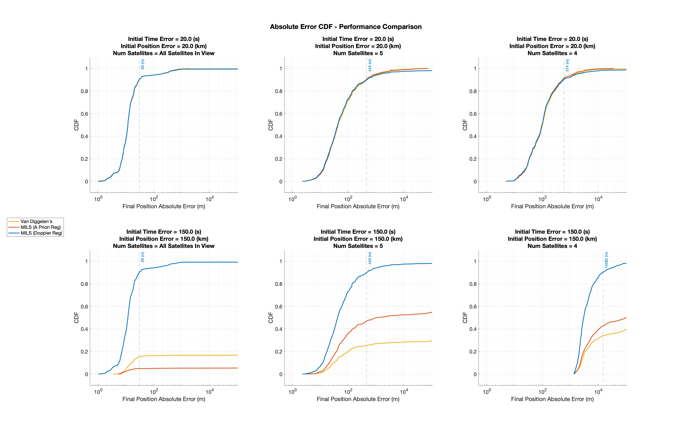
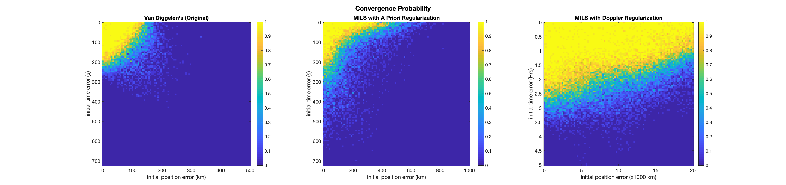

# snapshot-positioning
GNSS Snapshot Positioning Algorithms Research

Eyal Waserman and Sivan Toledo

Blavatnik School of Computer Science, Tel-Aviv University

## Absolute Position Error CDFs

## Convergence Probabilities

## Cites:
* Diggelen, Frank. (2009). A-GPS: Assisted GPS, GNSS, and SBAS. 
* Borre, K. The GPS Easy Suite–Matlab code for the GPS newcomer. GPS Solutions 7, 47–51 (2003).
* Chang, XW., Zhou, T. MILES: MATLAB package for solving Mixed Integer LEast Squares problems. GPS Solut 11, 289–294 (2007).
